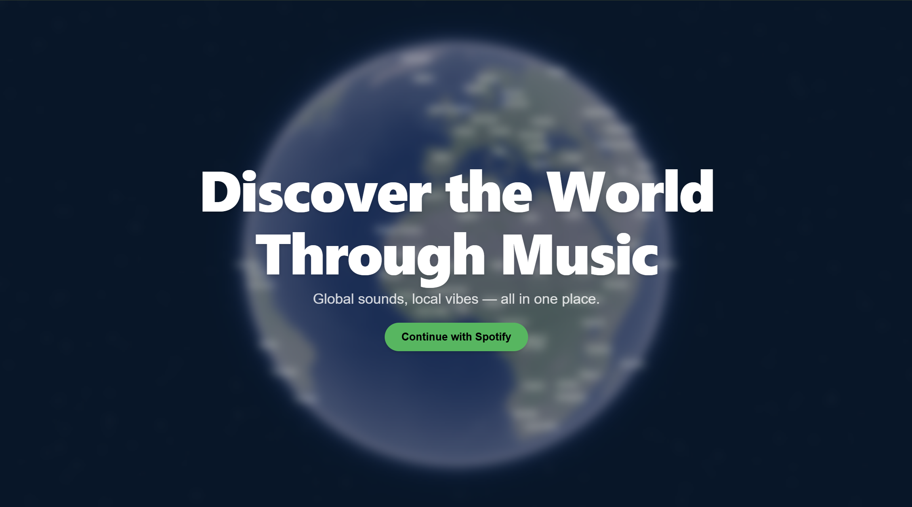

# DiscoverWorldly

https://discover-worldly.vercel.app/ #deprecated

HackHarvard 2025 Culture Track Submission
## Inspiration
Our goal with this project was to tie communities together through music. We felt that music is a core piece of many cultures, and music in different cultures can be very different. A lot of people in the US don't know what is popular in Russia, for example. DiscoverWorldly makes this possible. 
## What it does
When you first come to the website, it brings you to log in to your Spotify account. Next, you click on a part of the globe that you want to see popular songs from. Then, in a Tinder-like swiping style, you can preview the songs and swipe left if you don't like the song and right if you do. This then gets fed into Google Gemini to curate a 15-song playlist based on your taste and links it to your Spotify account directly. 
## How we built it
We split up the work evenly at every stage of the building process, whether it was the beginning, figuring out the Spotify API, or the final pieces. Each finished their designated potion and communicated with the others in the group to make sure we were all on the same page. This worked exceptionally well and was efficient. Group members got help when needed and everyone had a role. 
## Challenges we ran into
Throughout this project, we ran into multiple different challenges.  One major challenge was the use of the Spotify API.  None of our group members had any prior experience with the Spotify API.  This was a challenge and one that we were able to overcome through the intricate documentation that Spotify provides.  Through this challenge, we were able to grow as a team and enhance our web development skills.
## Accomplishments that we're proud of
We are proud of how we were able to use a multitude of resources and api's to build up the functionality of DiscoverWorldly.  We combined technologies in creative ways to develop and deploy a robust, practical app.
## What we learned
Through our development of DiscoverWorldly, we learned key aspects of data management and problem-solving.  We scanned through a multitude of documentation to effectively implement a wide array of technology.  We learned about the project development lifecycle at a hackathon and how to manage impending deadlines.
## What's next for DiscoverWorldly
DiscoverWorldly has a bright future! We plan on updating the user interface, the recommendations, and other functionalities of the website to be more optimized.
